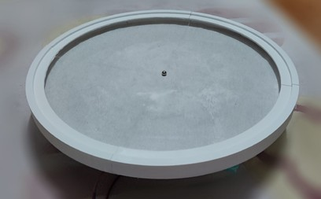
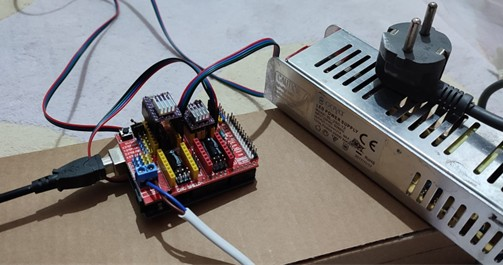
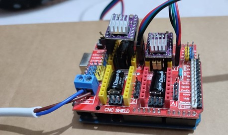
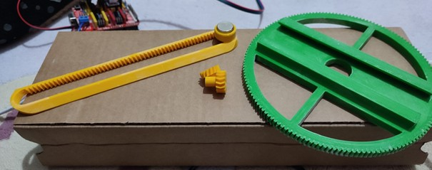
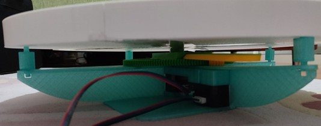

[230202036_Zeynep_YÜKSEL_EEE308_TERM_PROJECT.pdf](https://github.com/user-attachments/files/27501428/230202036_Zeynep_YUKSEL_EEE308_TERM_PROJECT.pdf)

# CIRCULAR TRAIL: 3D Printed Kinetic Sand Table

**Faculty of Engineering — Department of Electrical and Electronics Engineering**  
**EEE308 / MICROPROCESSORS — Experiment Design Report**

| | |
|---|---|
| **Student** | Zeynep YÜKSEL — 230202036 |
| **Instructor** | Res. Asst. Fatih MERCAN |
| **GitHub** | github.com/zeynepyukselotu/circular-trail |
| **Date** | May 2026 — Ankara |

---

## CONTENTS

1. [Introduction](#1-introduction)
2. [Project Description and Module List](#2-project-description-and-module-list)
3. [Hardware Design and Circuit](#3-hardware-design-and-circuit)
4. [Software Design](#4-software-design)
5. [Challenges Encountered](#5-challenges-encountered)
6. [Test and Validation](#6-test-and-validation)
7. [Appendix](#7-appendix)
8. [Conclusion](#8-conclusion)
9. [References](#references)

---

## 1. INTRODUCTION

### 1.1 Problem Definition

This project is a system that creates geometric patterns on a surface by moving a hidden magnet beneath the granular material. It is designed to be low-cost and fully customizable, using 3D-printed parts and standard electronic components.

In this project, sodium bicarbonate (baking soda) was used as the granular surface material instead of sand, due to its fine and uniform particle structure which allows cleaner and more precise pattern formation.

### 1.2 Project Objectives

To build a two-axis polar motion system using NEMA 17 stepper motors, DRV8825 drivers, and a CNC Shield on an Arduino Uno (as a microcontroller) to enable real time G-code interpretation by uploading GRBL firmware to the Arduino to convert polar coordinates into G-code commands by developing a C program running in Windows and transmitting them via a USB serial port to correct unwanted radial motion with a rack and pinion compensation algorithm and to draw different geometric patterns. All mechanical parts like gears, rack and pinion system are 3D printed, and the system is powered by a 12V power supply.

### 1.3 Scope and Assumptions

The process includes mechanical assembly, electronic connection, software development, and firmware configuration. The software is used via a terminal-based menu running on Windows. All components were purchased by me.

---

## 2. PROJECT DESCRIPTION AND MODULE LIST

### 2.1 Project Name and Purpose

**Project Name:** Circular Trail: 3D Printed Kinetic Sand Table

The aim of this project is to build a kinetic sand table that draws patterns in granular material using a steel ball guided by a hidden neodymium magnet underneath the surface.

### 2.2 Module List

**Table 1. Module List**

| MODULE | DESCRIPTION | RESPONSIBLE |
|--------|-------------|-------------|
| **Motor Control** | Stepper motor control for X (theta) and Y (rho) axes using DRV8825 motor drivers. Step and direction signals are generated via GRBL firmware. | Zeynep YÜKSEL |
| **Motion Planning** | Polar coordinate calculation and path tracing algorithm. Coordinate conversion, rack compensation, and pattern functions written in C language. | Zeynep YÜKSEL |
| **Communication** | Receiving G-code and motion commands via USB/UART connection. Windows COM port protocol. | Zeynep YÜKSEL |
| **Power Management** | Regulated 12V power supply and motor driver integration. Current control via Vref adjustment. | Zeynep YÜKSEL |

### 2.3 Hardware Components

**Table 2. Hardware Components**

| COMPONENT | MODEL/DESCRIPTION | QUANTITY |
|-----------|-------------------|----------|
| **Microprocessor** | Arduino Uno | 1 |
| **Motor Driver Card** | CNC Shield V3 | 1 |
| **Motor Drivers** | DRV8825 | 2 |
| **Step Motors** | NEMA 17 42-23 | 2 |
| **Power Supply** | 12V DC Power Supply | 1 |
| **Mechanical Parts** | 3D Printed Gears, Rack and Pinion, Tabletop | — |
| **Magnet** | Neodymium Magnet (N35) | 1 |
| **Steel Ball** | Steel Ball | 1 |

### 2.4 Task Allocation

Circuit design, C code implementation, and system integration were all carried out by me. Three distinct parts were handled by a single student: mechanical design and 3D printing, GRBL firmware setup and calibration, and C-based G-code control software development. This project was completed individually.

---

## 3. HARDWARE DESIGN AND CIRCUIT

### 3.1 System Overview

The general architecture of the system:

```
┌─────────────┐     USB Serial Port     ┌─────────────────┐
│  Windows PC │ ──────────────────────► │   Arduino Uno   │
│  (C Program)│                         │ (GRBL Firmware) │
└─────────────┘                         └────────┬────────┘
                                                  │
                                         ┌────────▼────────┐
                                         │  CNC Shield V3  │
                                         └───┬─────────┬───┘
                                             │         │
                                     ┌───────▼──┐  ┌───▼──────┐
                                     │ DRV8825 X│  │ DRV8825 Y│
                                     └───────┬──┘  └───┬──────┘
                                             │         │
                                     ┌───────▼──┐  ┌───▼──────┐
                                     │  Theta   │  │   Rho    │
                                     │  Motor   │  │  Motor   │
                                     └──────────┘  └──────────┘
```

The C program running on the computer converts polar coordinates into G-code commands and sends them to the Arduino via USB serial port. The GRBL firmware on the Arduino receives these commands and generates step (STEP) and direction (DIR) signals for the motor drivers. The CNC Shield acts as an interface board connecting the drivers to the Arduino pins.

### 3.2 Pin Connections

**Table 3. Pin Connections**

| SIGNAL | ARDUINO PIN | CNC SHIELD | DESCRIPTION |
|--------|-------------|------------|-------------|
| **X STEP** | Pin 2 | X-axis | Theta motor step signal |
| **X DIRECTION** | Pin 5 | X-axis | Theta motor direction signal |
| **Y STEP** | Pin 3 | Y-axis | Rho motor step signal |
| **Y DIRECTION** | Pin 6 | Y-axis | Rho motor direction signal |
| **ENABLE** | Pin 8 | ENA | Motor driver enable/disable |
| **12V GND** | — | PWR Terminal | Motor power supply connection |

### 3.3 DRV8825 Motor Driver Settings

Both DRV8825 drivers operate in 16x microstepping mode. The Vref value for the 1.5A rated current of the NEMA 17 42-23 motor was calculated using the following formula and verified with a multimeter:

```
Vref = Imax / 2 = 1.5A / 2 = 0.75V
Measured Vref: ~0.596V
```

Steps per revolution calculation: 200 steps/rev × 16 (microstepping) = 3200 steps/rev. With GRBL $100 = 320 steps/mm setting, the X50 = 1 full revolution calibration was experimentally verified.

---

## 4. SOFTWARE DESIGN

### 4.1 GRBL Firmware

GRBL is an open source motion control software that understands G-code, which is a standard language used to control CNC machines. The GRBL library was manually added to the Arduino IDE. CoreXY mode was disabled in the config.h file and the system was configured to operate in independent axis mode for the polar coordinate system. The grblUpload sketch was uploaded to the Arduino. Calibration parameters were entered via the Serial Monitor.

**Table 4. GRBL Configuration Parameters**

| GRBL PARAMETERS | VALUES | DESCRIPTION |
|-----------------|--------|-------------|
| **$100** | 320 | X steps/mm (Theta-axis) |
| **$101** | 287 | Y steps/mm (Rho/Rack-axis) |
| **$110** | 900 | X max feed rate (mm/min) |
| **$111** | 3000 | Y max feed rate (mm/min) |
| **$120** | 30 | X acceleration (mm/sec²) |
| **$121** | 30 | Y acceleration (mm/sec²) |
| **$3** | 2 | Motor direction mask |
| **$22** | 0 | Homing disabled |

### 4.2 C Program General Structure

The C program consists of four main sections:

- **Serial Port Management:** COM port open, read, write, and close operations using Windows API (windows.h)
- **Polar Movement Function (move_polar):** Conversion of theta/rho coordinates to G-code commands and rack compensation
- **Pattern Functions:** Circle, triangle, square, spiral
- **Main Menu:** User interface and pattern selection

Standard C libraries used: `stdio.h`, `stdlib.h`, `string.h`, `math.h`, `windows.h`. No additional libraries are required.

### 4.3 Polar Coordinate and Rack Compensation

The system uses a polar coordinate system (theta-rho) instead of a Cartesian X-Y system. Theta represents the angular axis and rho represents the radial axis. Due to the mechanical design, when the theta motor rotates, the rack also causes an unintended movement in the rho axis. To correct this, a compensation offset is calculated with each move_polar call:

```c
/* Kremayer compensation: rack shifts when theta rotates */
double offset = x_increment * (X_STEPS_PER_MM * X_SCALING)
                / (GEAR_RATIO * Y_STEPS_PER_MM * KREMAYER_OFFSET);
y_increment += offset;
```
*Figure 1. Rack Compensation Algorithm in move_polar()*

### 4.4 Pattern Algorithm

**Circle:** Rho is kept constant while theta increases from 0 to 2π. A smooth circle is generated using 360 interpolation points.

```c
void draw_circle(void) {
    int i;
    for (i = 0; i <= STEPS; i++) {
        double rho = 0.85;
        double theta = 2.0 * PI * i / STEPS;
        move_polar(theta, rho);
    }
}
```
*Figure 2. Circle Pattern Algorithm*

**Triangle and Square:** Corners are calculated in Cartesian space, edges are divided using linear interpolation, and each point is converted to polar coordinates using atan2(). Theta continuity is preserved to prevent the motor from rotating backwards.

```c
double cx = x1 + (x2 - x1) * t;    /* linear interpolation */
double r  = sqrt(cx*cx + cy*cy);    /* Pythagorean theorem  */
double th = atan2(cy, cx);          /* polar angle conversion */
/* Theta continuity: */
while (th < theta_acc - PI) th += 2.0 * PI;
while (th > theta_acc + PI) th -= 2.0 * PI;
```
*Figure 3. Linear Interpolation and Polar Coordinate Conversion*

**Spiral:** Archimedean spiral. As theta increases, rho simultaneously and proportionally rises from 0 to 0.85. A total of 1080 steps are used for 3 full turns.

---

## 5. CHALLENGES ENCOUNTERED

### 5.1 Calibration Difficulty

The X axis calibration (1 full revolution = how many mm in X?) could not be verified through standard calculation methods. Testing had to be carried out up to X1800 instead of the expected X50 value across different gear ratio and microstepping combinations. Eventually, the X50 = 1 full revolution calibration was confirmed through experimental testing via the Serial Monitor.

### 5.2 Rack Compensation

When the theta motor rotates, it mechanically shifts the rack and pinion system, causing an unintended movement in the rho axis. This meant that drawing a circle resulted in a spiral instead of a closed path. To fix this, a compensation offset proportional to the theta change was added to the rho increment in the move_polar() function. The offset constant (KREMAYER_OFFSET = 0.49) was determined experimentally through repeated testing.

### 5.3 Motor Overheating Issue

Drivers reached a temperature hot enough to burn the hand within 10 seconds due to GRBL keeping the motors continuously energized. The motors were disabled when idle using the $1=0 parameter and Vref was reduced. Heat sinks were ensured to make full contact with the drivers using thermal tape.

### 5.4 Mechanical Assembly

Several mechanical components had to be reprinted multiple times due to dimensional tolerances, gear misalignment, and fit incompatibilities between moving parts. This was necessary to achieve smooth and reliable motion in both the theta and rho axes.

---

## 6. TEST AND VALIDATION

**Table 5. Comparison of Outcomes**

| TEST | METHOD | RESULT |
|------|--------|--------|
| GRBL Connection Test | Serial Monitor: $$ Command | All parameters listed ✓ |
| Theta Calibration | G1 X50 F500: 1 full revolution observation | X50 = 1 revolution confirmed ✓ |
| Rho Test | G1 Y±11 F200: Edge/center check | Y±11 = full stroke confirmed ✓ |
| Circle Drawing | C Program: Option 1 | Closed circle achieved ✓ |
| Triangle Drawing | C Program: Option 2 | 3-sided shape achieved ✓ |
| Square Drawing | C Program: Option 3 | 4-sided shape achieved ✓ |
| Spiral Drawing | C Program: Option 4 | 3-turn spiral achieved ✓ |
| Vref Measurement | Multimeter: Trimpot Center | 0.596V measured ✓ |

---

## 7. APPENDIX

### 7.1 Visual Documentation

**Figure 1.** Granular surface and steel ball on the tabletop



**Figure 2.1.** Full system overview with power supply connected



**Figure 2.2.** Wiring and cable connections on CNC Shield



**Figure 3.** Rack and pinion system, gears, and magnet



**Figure 4.** Bottom view of NEMA 17 stepper motors and gears



---

## 8. CONCLUSION

A kinetic sand table was successfully designed and implemented using a polar coordinate system. The Arduino Uno, CNC Shield, DRV8825 hardware combination, together with GRBL firmware, created an effective platform for motor control.

On the software side, a C program was developed that communicates with GRBL via the Windows API through serial port, sends G-code commands, and implements polar coordinate calculation, rack compensation, and pattern drawing algorithms.

During the project, various technical challenges were encountered, such as GRBL installation, system calibration, rack and pinion compensation, and motor overheating issues; each was resolved using a systematic approach. The resulting system is capable of automatically drawing four different geometric patterns onto the surface of granular material (baking soda).

---

## REFERENCES

[1] P. Ganal, "GRBL v1.1h Firmware," GitHub, 2019. [Online]. Available: https://github.com/gnea/grbl.

[2] Protoneer, "Arduino CNC Shield V3.0 Documentation," Protoneer Blog, 2014. [Online]. Available: https://blog.protoneer.co.nz/arduino-cnc-shield. 

[3] Texas Instruments, "DRV8825 Stepper Motor Driver Datasheet," Texas Instruments, Dallas, TX, USA, 2014.

[4] Microchip Technology, "ATmega328P 8-bit AVR Microcontroller Datasheet," Microchip Technology Inc., Chandler, AZ, USA, 2015.

[5] Microsoft, "Serial Communications — Windows API Reference," Microsoft Developer Documentation, 2024. [Online]. Available: https://docs.microsoft.com/en-us/windows/win32/devio/communications-resources.

[6] Arduino, "Arduino Uno R3 Technical Specifications," Arduino Documentation, 2023. [Online]. Available: https://docs.arduino.cc/hardware/uno-rev3. 

[7] Standard NEMA MG 1, "Motors and Generators — NEMA 17 Frame Specifications," National Electrical Manufacturers Association, Rosslyn, VA, USA, 2016.
